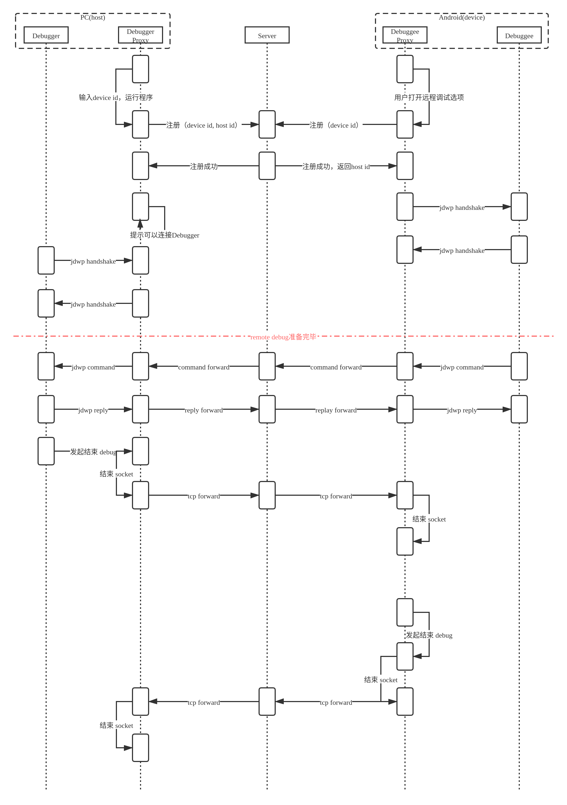

# AndroidRemoteDebug_TargetApp
【背景】  
偶然读到了美团的一篇文章[Android远程调试的探索与实现](https://tech.meituan.com/2017/07/20/android-remote-debug.html)，感觉比较有意思，就试着自己实现出来。  
为了避免重复造轮子，在我动手（2020年9月1日）之前，我在网上并没有搜索到有类似的完整项目，希望它是第一个：）  
  
  
引入较为严格的端到端的超时机制，只要出现一次超时就结束debug session。因而两端暂时不需要消息重发机制。  
本项目是Android（待调试）端demo。设备有限，小米（MIUI 10）和Vivo手机（系统版本不记得了）实测可用。设备只要能上网就可以（移动和wifi都行，不要求各端连接同一局域网）。  

# Host
作为jdwp debug 端 proxy，负责服务IDE的socket连接以及向DebugServer转发消息。  
  
* [项目地址](https://github.com/singleheaven/AndroidRemoteDebug_Host)
* [可运行jar下载](README_FILES/AndroidRemoteDebug_Host.main.jar)
* 运行方式：java -cp AndroidRemoteDebug_Host.main.jar singleheaven.remotedebug.host.Netty 192.168.1.1 8090

# Android demo app
  
* [项目地址](https://github.com/singleheaven/AndroidRemoteDebug_TargetApp)
* [apk下载](README_FILES/AndroidRemoteDebug_Target.apk)
* 运行方式：adb install AndroidRemoteDebug_Target.apk

# DebugServer
* [项目地址](https://github.com/singleheaven/AndroidRemoteDebug_Server)
* [可运行jar下载](README_FILES/DebugServer.jar)
* 运行方式：java -jar DebugServer.jar
# 参考的一些资料和开源项目
前人栽树，后人乘凉。从项目设计到实现，本人有幸能站在各位“巨人”的肩膀上，利用不到一个月的业余时间完成了该项目。非常感谢！  
* [JDWP 协议及实现](https://developer.ibm.com/zh/articles/j-lo-jpda3/)：结合工具 Wireshark，对协议传输过程做了一些抓包分析，对后续的开发和调试大有帮助。  
* [开源一个自用的Android IM库，基于Netty+TCP+Protobuf实现](https://www.jianshu.com/p/00ba0ac2fc96)：针对业务实现做了一些接口的变化。  
* [hack0z/byOpen](https://github.com/hack0z/byOpen)：做了lua->cmake编译环境的改造。
